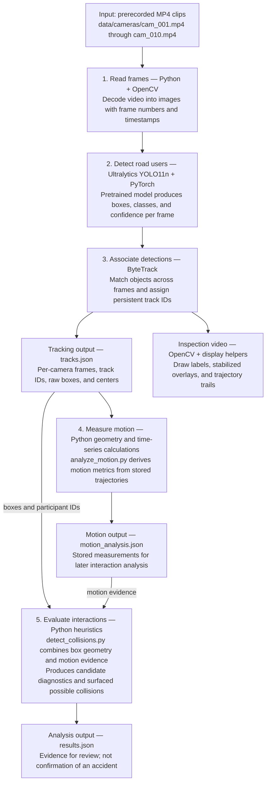
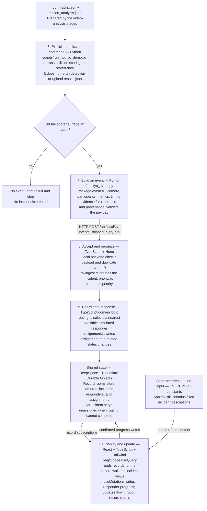
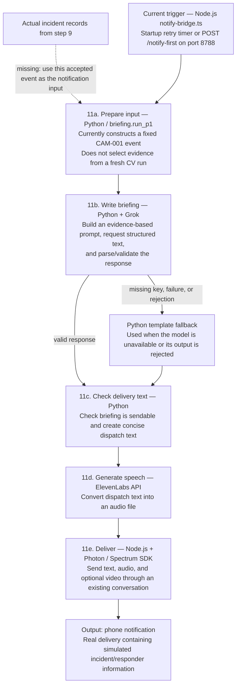
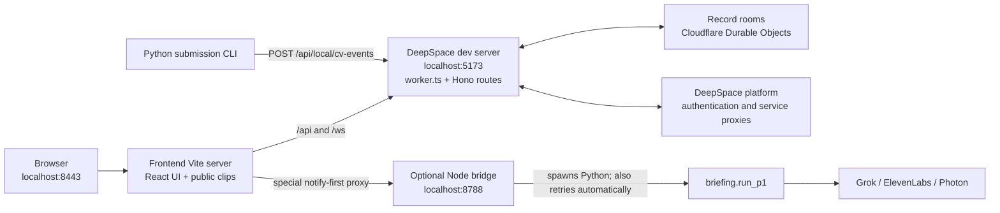

# NotifYC

NotifYC is a traffic incident review prototype that brings computer vision, a camera dashboard, and simulated responder coordination into one project. It explores how traffic video can become an evidence-backed incident report that a person can review and act on.

The project includes object tracking, motion analysis, possible-collision scoring, a ten-camera dashboard, responder assignment logic, and integrations for generated briefings and phone notifications. It uses pretrained models; no custom detection model is trained here.

**Current status:** this is a development/demo system. Camera footage is prerecorded, responders are simulated, and some displayed incident reports and notification inputs are hard-coded. The repository contains the pieces of the workflow, but they are not yet connected through one consistent, fresh CV run. A displayed incident is not proof of a confirmed collision.

## What I built

- **Video perception:** Python tools use YOLO11n and ByteTrack to detect road users, maintain track IDs, and produce annotated video and tracking records.
- **Motion and incident analysis:** later stages analyze trajectories and score possible collisions using observable motion and box geometry.
- **Incident dashboard:** a React interface presents a camera wall, camera details, incident evidence, and responder progress.
- **Responder coordination:** backend domain logic validates incoming CV events, prioritizes incidents, and assigns available simulated responders.
- **Briefings and notifications:** Python and TypeScript integrations support Grok-generated briefings, a deterministic fallback, ElevenLabs voice, and Photon messaging.

The frontend and backend began as Figma Make and DeepSpace scaffolds and were adapted into the application. The [cleanup audit](docs/CODEBASE_CLEANUP.md) records removed scaffold leftovers and remaining technical debt.

## How the pieces fit together

Read these diagrams in order: **video analysis → application records → notification**.
Each numbered box names the technology, its job, and what it produces. Solid
arrows describe implemented paths. The dashed arrow marks work that is still
missing; it does not represent an automatic connection.

### A. Turn video into possible-collision evidence



Steps 1–3 run inside `cv/track_objects.py`; steps 4 and 5 are separate commands.
The annotated video helps inspect tracking, while downstream analysis uses
stored measurements. A visually smoother box does not create new evidence.

### B. Turn a surfaced event into dashboard state



Submission is a deliberate CLI action. Starting the web app does not start CV
processing. Camera records must already exist; duplicate event IDs are returned
without creating another incident. Event evidence is a file reference, not an
automatic video upload. The primary dashboard currently mixes record-backed
state with fixed report text, so not everything visible comes from that event.

### C. Generate and deliver the current demo notification



Grok summarizes supplied evidence; it does not detect a collision or assign an
officer. ElevenLabs and Photon are optional integrations for the project, but
this particular P1 path requires successful voice generation before delivery.
The fixed P1 input and fixed UI reports can disagree with actual CV output.

### What runs where



You open one browser tab, while the frontend and backend run in two terminals.
The optional notification bridge is a third process. Its startup can send a
message without a dashboard click. The proxy exists, but the current primary UI
has no manual notification callback wired to it.

### Why these technologies are here

These explanations describe their roles in the implementation; they are not a
record of why every original design decision was made.

| Choice | Role and benefit in this project | Tradeoff or boundary |
|---|---|---|
| **DeepSpace** | Supplies React record providers, shared schemas, authentication plumbing, server action tools, and record rooms. This lets the dashboard share incident and responder state. | Couples the UI to the SDK and app identity. It does not run Python detection or decide that a collision happened. Replacing it requires replacing these services and frontend imports. |
| **Cloudflare Workers + Durable Objects** | The worker handles HTTP/WebSocket routes; record rooms provide the stateful storage layer used by app records. | Local Python processing and the Node Photon socket run separately from the worker. |
| **React + TypeScript** | Builds the camera wall, incident views, and progress controls with shared data types. | Some presentation data remains fixed in `App.tsx`; types alone cannot establish evidence provenance. |
| **Vite + Tailwind CSS** | Provides the frontend development/build process, backend proxies, and styling. | The proxy configuration is for development; a production frontend needs equivalent routing. |
| **Python + OpenCV + NumPy** | Reads/writes video and computes frame geometry and motion measurements. | Pixel measurements depend on camera perspective; they are not calibrated physical speed. |
| **YOLO11n + ByteTrack** | YOLO detects objects per frame; ByteTrack associates detections into track IDs across frames. | Pretrained detection and tracking can miss objects or switch IDs. Neither alone confirms a collision. |
| **Grok + deterministic fallback** | Converts supplied incident evidence into a structured responder briefing; failures or rejected responses use a template fallback. | The language model describes supplied evidence; it is not the collision detector. |
| **ElevenLabs + Photon** | Adds optional spoken output and phone-message delivery. | Requires separate credentials and can produce real external messages. |

For a deeper walkthrough, see [the codebase map](docs/ARCHITECTURE.md): record
relationships, request sequences, module responsibilities, and current gaps.

| Part | Technology | Location |
|---|---|---|
| Presentation UI | React, TypeScript, Vite, Tailwind CSS | `frontend/` |
| Backend and original UI | DeepSpace, Cloudflare Worker, TypeScript | `deepspace/` |
| Computer vision | Python, Ultralytics YOLO11n, ByteTrack, OpenCV, NumPy | `cv/` |
| Briefing and delivery helpers | Python, Grok, ElevenLabs | `briefing/` |
| Phone integration | Photon / Spectrum SDK | `deepspace/src/integrations/photon/` |
| Clip preparation and diagnostics | Python, FFmpeg | `scripts/` |

The presentation UI imports schemas, domain code, and SDK packages from `deepspace/`, so both Node projects are needed.

## Branches and project history

**Use `main` for the complete project.** Frontend, backend, CV, and briefing code
live together in directories in this branch; you do not switch branches to run
a different component.

```text
main                         Current combined application and documentation
└── archive/old-main (tag)    Historical snapshot, not an active development branch
```

The diagram above is a navigation guide, not a Git ancestry graph. The former
`backup-old-main` and `cv-history` branches have been removed from GitHub.
The old main snapshot is preserved under the `archive/old-main` tag; the earlier
CV commits are already in `main` history. Tags preserve historical versions and
do not receive new development commits.

For new work, create a short-lived feature or fix branch, review and merge its
changes into `main`, then delete that branch. This keeps one clear current
version for reviewers while retaining the development history.

## Run the dashboard locally

### Prerequisites

- Node.js matching `deepspace/package.json`: `>=22.15.0 <23`, `>=24 <25`, or `>=26 <27`.
- npm 11.6 or newer, plus pnpm for the frontend lockfile.
- Access to the configured DeepSpace app for services that require authentication. The checked-in app identity belongs to this project; a separate deployment needs its own DeepSpace configuration.

Run these commands from your clone of the repository.

**Terminal 1 — backend:**

```bash
cd deepspace
npm ci
npm run dev
```

The backend normally serves on `http://localhost:5173`. If the CLI requests authentication, use `npm run login` in this directory and restart it.

**Terminal 2 — frontend:**

```bash
cd frontend
pnpm install --frozen-lockfile
pnpm dev
```

Open **http://localhost:8443**. Keep both terminal processes running. You only need the frontend browser tab: Vite forwards API and WebSocket traffic to the backend.

For an empty app, first open `http://localhost:5173/home` and sign in; the
original UI seeds the demo cameras and responders. Then return to port `8443`.

There is no root `package.json`; install dependencies inside the two project directories. These startup commands do not run the optional notification bridge or execute the Python CV pipeline.

## Run the computer vision tools

### Python setup

Use Python 3.11 for the project's existing environment setup:

```bash
python3.11 -m venv .venv
source .venv/bin/activate
python -m pip install --upgrade pip
python -m pip install -r requirements.txt
```

Run the following commands from the repository root. Input footage, model weights, and generated outputs are ignored by Git and must be supplied or generated locally.

### Start with one video

Place a clip at `data/input/intersection.mp4`, then run:

```bash
python cv/process_video.py --input data/input/intersection.mp4
```

This standalone annotator tracks people, bicycles, cars, motorcycles, buses, and trucks. It draws boxes, class labels, track IDs, and trails, then saves `outputs/processed/intersection_processed.mp4`. It does not score collisions.

The first run can download the pretrained `yolo11n.pt` weights. The multi-camera tracker below expects that file to already exist at the repository root.

### Multi-camera analysis

The demo tracker expects ten files named `cam_001.mp4` through `cam_010.mp4` under `data/cameras/`. Once those inputs and `yolo11n.pt` are available, run the stages in order:

```bash
python cv/track_objects.py
python cv/analyze_motion.py
python cv/detect_collisions.py
```

| Stage | Main output |
|---|---|
| Tracking | `outputs/tracking/tracks.json` and annotated tracking videos |
| Motion analysis | `outputs/motion/motion_analysis.json` |
| Collision scoring | `outputs/evaluation/results.json` |

These commands use shared output paths. The tracker reads an existing `tracks.json`; `--only cam_001.mp4` updates one camera while retaining other camera records. They do **not** create isolated run IDs automatically. For a clean experiment, use a separate working copy or move previous stage outputs aside before starting. Preserve previous results if you need to compare runs.

`scripts/prepare_demo_clips.py` can cut the predefined ten clips from three local source videos. It requires FFmpeg and FFprobe; its timestamps are specific to the demo source layout. Diagnostic and viewer scripts are also available under `scripts/`.

### Inspect or submit a stored CV result

After tracking and motion analysis, inspect one camera without writing backend records:

```bash
python scripts/run_notifyc_demo.py --camera CAM-001 --dry-run
```

To submit surfaced events to the running local backend, omit `--dry-run`:

```bash
python scripts/run_notifyc_demo.py --camera CAM-001 --bridge http://127.0.0.1:5173
```

Submission validates events and can create incidents and simulated assignments.
It does not send a Photon notification. The local intake is enabled only when
`ALLOW_DEBUG_ROUTES` is `true`, as configured by the DeepSpace development server.

## Briefings and optional integrations

To print a clearly labeled demo briefing without dispatching a notification:

```bash
python -m briefing.run_test
```

Without `XAI_API_KEY`, this prints the deterministic fallback. With the key configured, it can request a Grok-generated briefing.

| Configuration | Purpose |
|---|---|
| `XAI_API_KEY` | Grok briefing generation |
| `XAI_MODEL`, `XAI_TIMEOUT_SECONDS` | Optional model and timeout overrides |
| `ELEVENLABS_API_KEY` | Optional voice generation |
| `PHOTON_PROJECT_ID`, `PHOTON_PROJECT_SECRET` | Photon messaging credentials |
| `PHOTON_TEST_PHONE` | Recipient used by the test-phone delivery path |

Environment loading differs between entrypoints; export variables in your shell or check the relevant script's loader. Keep credentials out of version control.

The local notification bridge, `deepspace/src/server/notify-bridge.ts`, listens on port `8788` and attempts an automatic P1 notification when started. It invokes `briefing/run_p1.py`, which currently constructs a fixed CAM-001 event. Notification scripts can send real messages even though responders and incidents are simulated; they are separate from the dashboard quick start.

## Repository guide

```text
frontend/       Primary presentation UI and local Vite proxy
deepspace/      Backend, schemas, domain logic, original UI, integrations
cv/             Detection, tracking, motion, and collision analysis
briefing/       Briefing generation, validation, fallback, and delivery
scripts/        Clip preparation, diagnostics, viewers, and demo tools
docs/           Maintenance notes and cleanup findings
data/           Local input clips and evidence (ignored)
outputs/        Generated videos and analysis records (ignored)
```

## Checks and known limitations

From the repository root:

```bash
# Python CV unit tests
.venv/bin/python -m unittest discover -s cv -p 'test*.py' -v

# Frontend production build
(cd frontend && pnpm build)

# Backend unit tests and TypeScript checks
(cd deepspace && npm run test:unit)
(cd deepspace && npm run type-check)
```

At the cleanup checkpoint, the frontend build and TypeScript checks passed, and all three CV unit tests passed. Backend unit tests had 36 passes and six failures involving responder selection, availability, and priority ranking. The same failures reproduced on the pre-cleanup commit. Backend TypeScript also reported existing `.ts` import-extension errors in Photon scripts. These are known issues, not a claim that the whole repository is passing.

Other current limitations:

- `frontend/src/App.tsx` contains fixed `CV_REPORT` entries, and `briefing/run_p1.py` uses fixed incident evidence. Neither should be treated as fresh detector output.
- Pixel-space trajectories and bounding-box overlap are imperfect evidence. Occlusion, ID changes, and camera perspective can affect incident scoring.
- CV outputs are not automatically isolated by run or consistently carried through to the UI and notifications.
- The DeepSpace directory still includes an original UI alongside the primary frontend. Shared imports and backend services make it an active dependency.

See [CODEBASE_CLEANUP.md](docs/CODEBASE_CLEANUP.md) for the detailed maintenance findings.

## Troubleshooting

- **Dashboard cannot load backend data:** check that the backend is running on port `5173` and that DeepSpace authentication/configuration is available.
- **Missing clips or model:** check `data/cameras/` and the root `yolo11n.pt`. Local ignored files are absent from a fresh clone.
- **Python cannot import `cv2` or `ultralytics`:** activate `.venv` and install `requirements.txt` there.
- **Annotated video will not play:** the standalone OpenCV writer uses `mp4v`; try VLC if your player does not support it.
