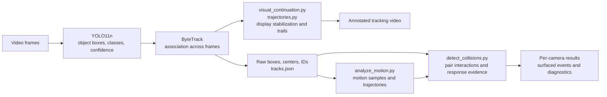
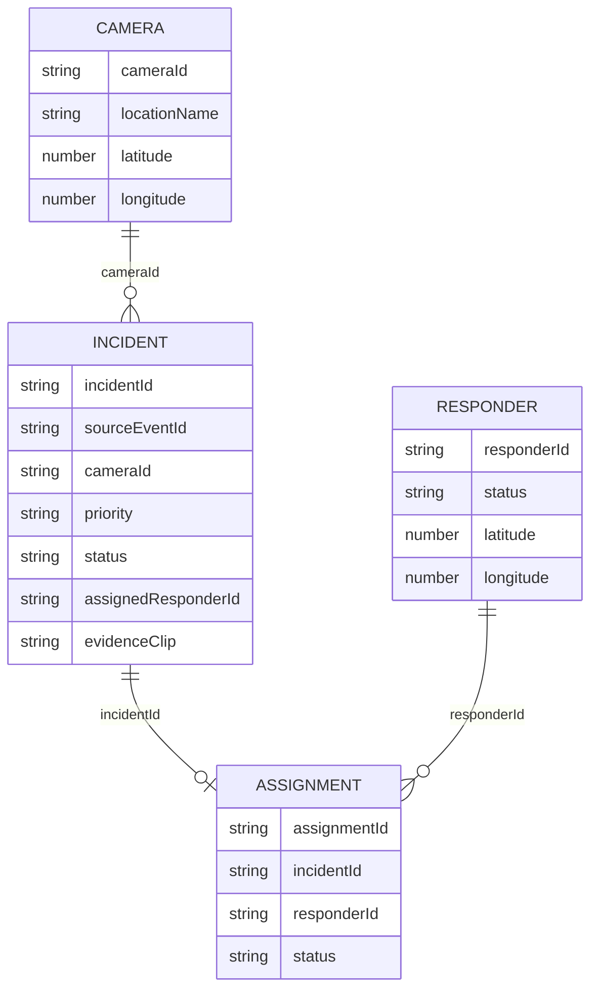
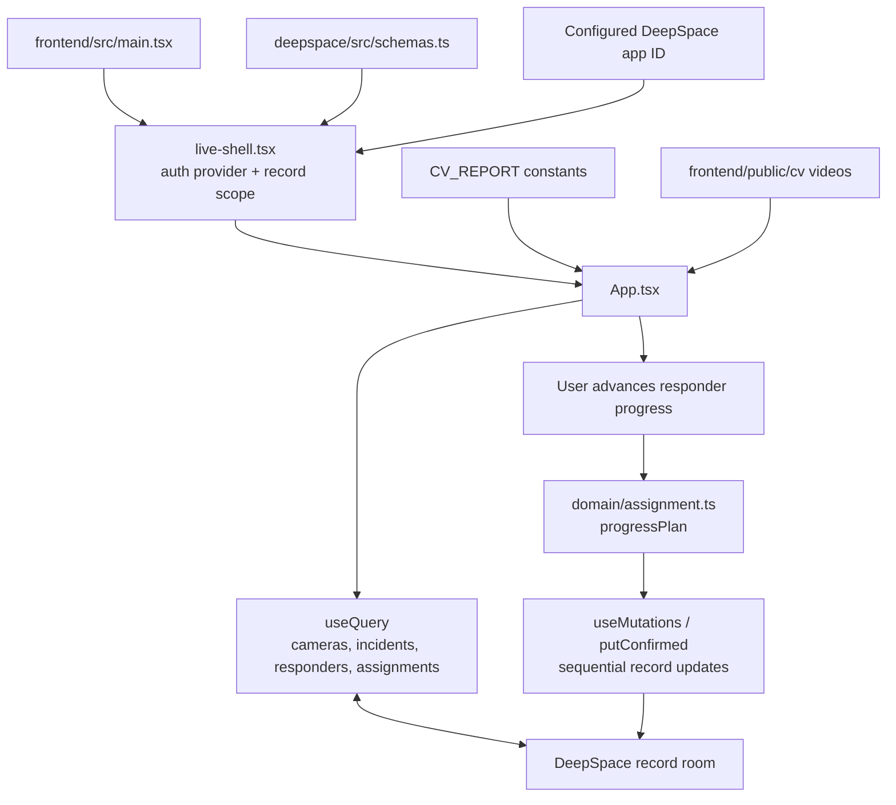
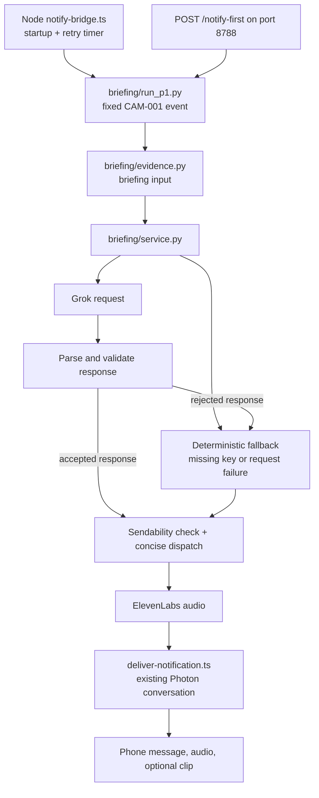

# NotifYC codebase map

This is a map of the implementation, including its demo shortcuts. Start with the
[README diagrams](../README.md#how-the-pieces-fit-together) for the whole system.
This document explains what each boundary does and where to look when changing it.

## 1. Video becomes measurements, then candidate evidence



| File | Responsibility | Why it is separate |
|---|---|---|
| `cv/process_video.py` | Standalone video annotator and shared video/drawing helpers | Lets a developer inspect basic detection/tracking without the later scoring stages |
| `cv/analyze_objects.py` | Standalone object-detection analysis | Supports inspecting perception separately from persistent tracking |
| `cv/track_objects.py` | Runs multi-camera detection and tracking; writes raw records and annotated video | Owns the frame-by-frame perception stage |
| `cv/bytetrack.yaml` | Tracker parameters | Makes association settings explicit |
| `cv/visual_continuation.py`, `cv/trajectories.py` | Visual continuity, geometry stabilization, and trails | Display behavior is distinct from the raw measurements consumed downstream |
| `cv/analyze_motion.py` | Derives motion information from stored tracks | Motion can be inspected without rerunning the detector |
| `cv/detect_collisions.py` | Evaluates interactions and surfaces possible collisions | Keeps collision heuristics separate from object detection |
| `cv/notifyc_event.py` | Converts surfaced results into the web app's event format | Defines the boundary between Python analysis and TypeScript intake |

A detector box is a measurement; a track ID is an association; an incident is a
later inference. Errors can propagate through all three. A smoothed overlay is
not additional detector evidence.

## 2. A submitted event becomes application records

The following sequence occurs only when someone explicitly runs the submission
command without `--dry-run`. The runner reads stored tracking/motion files and
calls the collision scorer again. It does not start video processing.

```mermaid
sequenceDiagram
    participant CLI as scripts/run_notifyc_demo.py
    participant CV as Collision scorer + notifyc_event.py
    participant API as POST /api/local/cv-events
    participant Domain as cv-ingest.ts
    participant Store as DeepSpace record room
    participant Route as assignment.ts + routing.ts
    CLI->>CV: Score stored camera results
    CV-->>CLI: Surface events, convert, validate
    alt No surfaced event
        CLI-->>CLI: Print no incident; stop
    else Event exists
        CLI->>API: Structured JSON event
        API->>API: Require local debug mode
        API->>Domain: ingestCvEvent
        Domain->>Store: Check event ID and load camera
        alt Already ingested
            Store-->>Domain: Existing incident
            Domain-->>CLI: Duplicate result; no new incident
        else New event
            Domain->>Domain: Compute priority and incident fields
            Domain->>Store: Create incident
            Domain->>Route: Try nearest available responder
            Route->>Store: Create assignment and update related records
            Domain-->>CLI: Assigned or unassigned result
        end
    end
```

`priority.ts` derives operational priority from supplied observable metrics.
`routing.ts` selects a responder using availability and geographic distance.
`assignment.ts` coordinates the record writes. The incident can remain open and
unassigned if routing cannot complete. These decisions are ordinary application
code; Grok does not choose the responder.

The camera catalog must already be loaded. `deepspace/src/actions/index.ts`
contains `seedDemoData`, which loads demo cameras/responders. Starting an empty
backend does not mean the primary frontend has seeded these records for you.
The original DeepSpace UI at `http://localhost:5173/home` calls the seed action
after sign-in.

## 3. The data model

These are logical relationships between IDs in records, not a declaration of
SQL foreign-key constraints.



The complete types live in `deepspace/src/domain/demo-data.ts`; schemas live in
`deepspace/src/schemas.ts`. An incident also carries participant track IDs,
evidence timing, score, observations, and detection provenance. Evidence paths
reference files; they do not embed or automatically upload video.

Clip-relative timestamps are converted to ISO strings by `clipSecondsToIso`.
Those strings represent clip time, not the real-world date an accident happened.

## 4. How the dashboard stays connected



The primary UI reads record-backed state and also displays fixed reports. These
are two different data sources. `progressPlan` supplies updates for acceptance,
travel, arrival, and resolution. The frontend applies them in separate writes;
this is not one atomic transaction across all records.

DeepSpace provides the connection, record APIs, schemas, and authentication
plumbing that this code uses. `worker.ts` assembles Hono routes and exports
Durable Object classes. `server/realtime-routes.ts` connects record traffic;
`server/action-routes.ts` connects authenticated actions to app tools;
`server/http-routes.ts` handles platform/auth proxies and static serving.
Some optional platform rooms and handlers are scaffold support rather than
traffic-specific features, but they are registered in the worker/configuration.

## 5. Notification flow is a separate demo path



Voice is optional for the broader project, but this particular `run_p1.py` path
currently returns a failure if voice generation fails.

There are two easily confused endpoints:

| Request | Actual behavior |
|---|---|
| Backend `5173/api/local/cv-events/notify-first` | Reads and ranks existing incident records; returns JSON; does not itself send a phone message |
| Frontend `8443/api/local/cv-events/notify-first` | Vite routes this specific path to `8788/notify-first`; that bridge invokes the fixed P1 notification flow |

The conversation service is another Photon process and can also trigger
notification behavior. Do not treat launching integration processes as a
read-only way to inspect the project.

The fixed event in `run_p1.py` currently labels itself `computer-vision` and names
the collision pipeline despite constructing the values in code. That provenance
is misleading. The diagrams label it as a fixture so readers do not mistake it
for a fresh detection. Replacing this path with an accepted event from a specific
run remains necessary work.

## 6. Source, demo fixtures, and generated data

| Category | Examples | Repository treatment |
|---|---|---|
| Application source | `cv/`, `briefing/`, TypeScript source, configuration | Keep and review |
| Active demo fixtures | `demo-data.ts`, `CV_REPORT`, `p1_event()` | Used by current behavior; explicitly documented as simulated/fixed |
| Browser video assets | `frontend/public/cv/`, `deepspace/public/cv-wall/` | Tracked and referenced by their respective UIs |
| Local source/evidence data | `data/` | Ignored; supplied locally |
| Generated analysis/video/audio | `outputs/` | Ignored; retain locally for experiment comparison |
| Dependency/build caches | `node_modules/`, `.venv/`, `dist/`, `.vite/` | Ignored; recreated through installation/build |

Repeated demo video assets are not unreferenced junk: the two UIs use different
public paths. Consolidating the UIs would make it possible to consolidate their
assets as a separate change. Removing the files today would break playback.

## 7. Where to make a change

| Desired change | Start here |
|---|---|
| Detection classes or tracking behavior | `cv/track_objects.py`, `cv/bytetrack.yaml` |
| Motion measurements or collision rules | `cv/analyze_motion.py`, `cv/detect_collisions.py` |
| Python-to-backend event contract | `cv/notifyc_event.py`, `deepspace/src/domain/cv-ingest.ts` |
| Incident priority or responder choice | `deepspace/src/domain/priority.ts`, `routing.ts`, `assignment.ts` |
| Dashboard layout or styling | `frontend/src/App.tsx`, `frontend/src/index.css` |
| Record structure or access rules | `deepspace/src/schemas.ts`, server routes and worker |
| Briefing wording and validation | `briefing/prompt.py`, `validate.py`, `fallback.py` |
| Phone delivery | `deepspace/src/integrations/photon/`, `briefing/run_p1.py` |

The next architectural improvement is one event source shared by the UI and
notification flow, with a run ID and matching evidence artifact. That requires
removing fixture overrides, isolating CV outputs, and checking provenance across
each boundary. The current diagrams deliberately show that gap.
